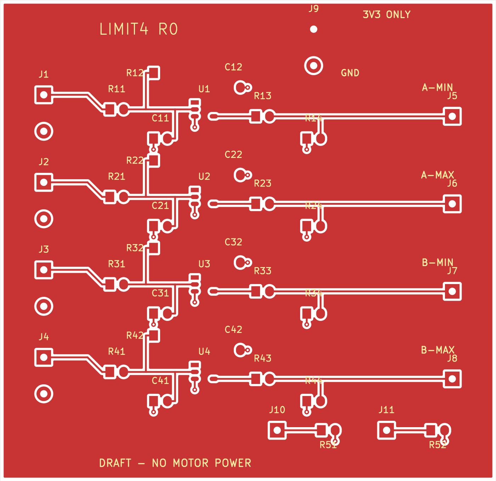

# Dual Actuator Controller / LIMIT4 R0

**Actual hardware design, engineering draft. Not released for fabrication or motor operation.**



Two small brushed actuators, four normally-closed dry-contact limit loops, and an explicit stopped/fault state. This revision adds a **68x66mm two-layer LIMIT4 input-conditioning PCB** to the existing OpenDualMotorDriver power motherboard. It does not claim to redesign or validate that entire power stage.

## Open the hardware

- [Editable schematic](hardware/limit4.kicad_sch), [schematic PDF](build/limit4-schematic.pdf)
- [Editable routed PCB](hardware/limit4.kicad_pcb), [local footprints](hardware/LIMIT4.pretty)
- [BOM qualification](hardware/BOM.csv), [electrical manifest](hardware/design.json)
- [Evidence/calculations](docs/EVIDENCE.md), [power/reset states](docs/STATES.md)
- [Integration pin map](docs/INTEGRATION.md), [bench acceptance](docs/VALIDATION.md)
- [Motion state machine](firmware/motion.hpp), [Pico2 dry-run](firmware/pico_dryrun.cpp)
- [Validation outputs](build/), [licence conflict/provenance](docs/PROVENANCE.md)

## Actual increment

Each NC loop has an RC front end and TI SN74LVC1G14DBVR Schmitt inverter. Closed contact yields ALLOWhigh; open contact or disconnected loop yields low. An external output pull-down defines the input when the buffer is unpowered/disconnected. Two optional reset pulls connect through explicit rework pads.

Command acceptance is distinct from physical motion completion. A loop opening is reported as LIMIT_OPEN, not automatically as arrival. The circuit cannot distinguish an endpoint from a broken wire and cannot detect a short across the switch. Corresponding limit, driver fault, expired communication or motion timeout clears motion requests. Reclosing a switch cannot restart motion; an explicit new command is required to retreat.

Based on the interfaces of [Miloš Rašić's OpenDualMotorDriver](https://github.com/MilosRasic98/OpenDualMotorDriver), commit `9a938240a8053269b1b8786dccdb6d541cb7396c`. Original motor bridge, current sensors and original images remain the upstream author's work. This project supplies the extension, independent controller code and review documents.

AI-assisted engineering. No physical derivative has been assembled or measured. CAD/host tests establish file consistency/software behavior only. Dry-run firmware keeps PWM and RESET low. Real-drive compilation is blocked until independent review, motor/contact selection and physical qualification. This is not an emergency stop, safety-rated interlock, industrial24V input or certified assembly. All motor operation and purchasing are outside R0.

## Reproduce

With KiCad8+ and its system pcbnew module:

```sh
python3 tools/build_hardware.py
c++ -std=c++17 -Wall -Wextra -Werror tests/motion_test.cpp -o /tmp/test
/tmp/test
kicad-cli sch export pdf -o build/limit4-schematic.pdf hardware/limit4.kicad_sch
kicad-cli sch export netlist --format kicadxml -o build/limit4.xml hardware/limit4.kicad_sch
kicad-cli pcb drc --format json -o build/drc.json hardware/limit4.kicad_pcb
python3 tools/check_connectivity.py
```

Native files and generator are both included. Rerunning the generator overwrites generated CAD; port manual edits back deliberately. The existing software main branch and private archive remain untouched. This hardware branch can be moved into a separate repository without changing its files.
