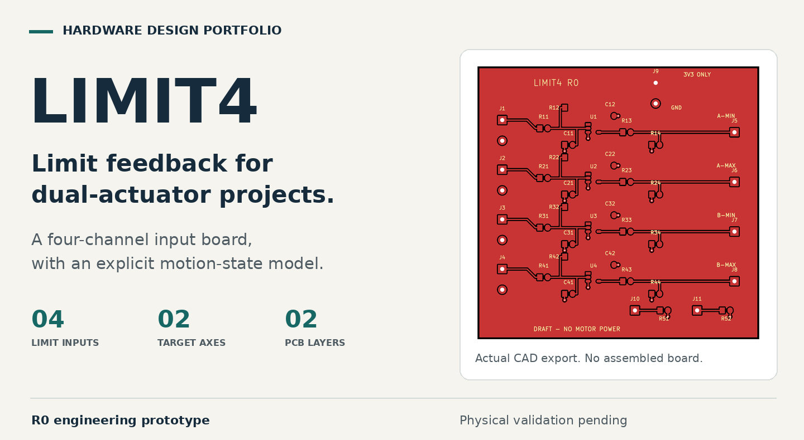

# LIMIT4

### Four limit-switch inputs for dual-actuator projects

[中文介绍](README.zh-CN.md) | [Schematic](build/limit4-schematic.pdf) | [PCB source](hardware/limit4.kicad_pcb) | [Engineering details](docs/ENGINEERING.md)

**Stage: unbuilt engineering prototype.** The interface PCB and software checks are complete for this revision. The Pico 2 firmware is a dry-run build with motor outputs disabled.

## The problem

A small motorized prop has two distinct questions: did the controller accept the command, and did the mechanism reach its destination? A motor driver alone does not answer both.

LIMIT4 explores the interface between physical end stops and motion control. It provides four normally closed contact inputs for two actuator axes, with signal conditioning and a separate software model for stopped, moving, limit-open and fault states.

## The design contribution

**A board-level interface.** A two-layer, 68 x 66 mm PCB with four repeated input channels, local filtering, Schmitt-trigger conditioning and defined output biasing. Editable schematic, layout and project-local libraries are included.

**Explicit motion states.** The independent controller code handles directional limits, invalid reversal requests, driver-fault input, command timeout and communication expiry. A switch closing again does not automatically restart a stopped request. These behaviors are covered by host tests; physical stopping is not yet validated.

**Traceable engineering.** Component assumptions, reset and power-state analysis, source-to-layout checks and a bench qualification plan are retained with the design.

## What is new, and what is reused?

| This project's contribution | Existing upstream platform |
|---|---|
| LIMIT4 input-conditioning PCB and local CAD libraries | OpenDualMotorDriver motor-power motherboard |
| Independent motion-state code and dry-run wrapper | Existing bridge and current-sensing hardware |
| Interface analysis, tests and verification records | Published motherboard interfaces |

The reference platform is [OpenDualMotorDriver by Milos Rasic](https://github.com/MilosRasic98/OpenDualMotorDriver). The original power board has not been redesigned or qualified by this project. No original firmware or hardware photographs are presented as new work. Development of this extension was AI-assisted.

## Verification so far

The recorded KiCad checks report **zero ERC errors, zero DRC errors and zero unrouted items**. Cross-file checks cover 84 connected pin assignments and four NC pads. The motion-state tests pass 47 assertions, and the output-disabled program cross-compiles for Pico 2.

[Check records](build/check-summary.json) | [Software test record](build/host-tests.txt) | [Validation scope](docs/VALIDATION.md)

**Still to validate:** assembly, actual contacts, power sequencing, noise response and motor integration. A limit-loop opening cannot distinguish an endpoint from a broken wire. R0 is not released for fabrication, motor operation or personnel protection.

## Explore the work

Start with the [schematic PDF](build/limit4-schematic.pdf) and [PCB layout](build/pcb-top.png). The [engineering guide](docs/ENGINEERING.md) collects the BOM, interface mapping, calculations, source files and reproduction steps.

Hardware: [CERN-OHL-S-2.0](LICENSES/CERN-OHL-S-2.0.txt). Independent firmware: [MIT](firmware/LICENSE). [Attribution and upstream licence discrepancy](docs/PROVENANCE.md).
