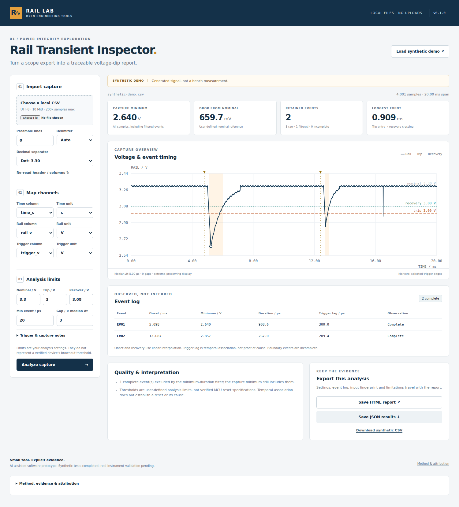

# Rail Transient Inspector

**Local oscilloscope CSV analysis for power-rail voltage dips and trigger timing.**

`v0.1.0` · Software prototype · Synthetic validation · AI-assisted development

[](https://github.com/kkybby/rail-transient-inspector/actions/workflows/test.yml)

[中文说明](README.zh-CN.md) · [Method](docs/ALGORITHM.md) · [Validation](docs/VALIDATION.md) · [Provenance](THIRD_PARTY_NOTICES.md)



## What problem does it address?

An exported scope trace can show a rail dipping near an actuator or logic event. Turning that capture into a reviewable record requires more than plotting it: which threshold was used, what counted as recovery, which short events were excluded, and whether the timestamps contain gaps all affect the result.

This tool turns a local CSV into a **hysteresis-defined event log**, a voltage plot and an exportable report. It records the assumptions and data-quality limitations with the results. It does not diagnose a reset, determine a root cause, or certify a design.

## Try it

Open **`standalone.html`** in a modern desktop browser. Everything needed by the app is bundled locally. Start with **Load synthetic demo**, or import your own UTF-8 CSV. No npm install, account, CDN, API key or backend is needed to use the bundled app.

If a source checkout does not yet contain `standalone.html`, run `python3 tools/build_demo.py` (Python 3 and Node.js 22+); the parser is restored from its pinned, hash-verified upstream version if needed. The CI workflow also generates the bundle, synthetic reports and real screenshots of the demo.

For a modular development copy, serve this directory with a local static-file server and open `index.html`. Direct URL navigation was blocked by the validation environment's browser policy; browser smoke checks used the same bundled page via Playwright `set_content`. The packaged app still requires local verification in the end user's browser.

1. Select a file and explicitly skip any metadata/preamble lines.
2. Select the time, rail and optional trigger columns. **Confirm their units**.
3. Enter nominal, trip and recovery voltages, and an event-duration filter.
4. Analyze, inspect the warnings and export JSON or a self-contained HTML report.

Built-in thresholds are demonstration values. No chip, reset threshold or hardware configuration is assumed. All included sample data and screenshots are **synthetic**, not bench measurements.

## Project-specific additions

| Layer | Implemented here |
|---|---|
| Import discipline | Header-consistent delimiter detection; explicit unit conversion; rejection of malformed rows, duplicate timestamps and invalid numeric values |
| Event analysis | Separate trip/recovery limits, linear crossing estimates, minimum-duration filtering with excluded events preserved |
| Evidence boundaries | No gap interpolation; incomplete capture/gap events marked as censored and retained |
| Trigger timing | Optional preceding-edge association in the same continuous segment and within a defined window |
| Reporting | Extrema-preserving plot, event table, JSON/HTML exports, settings and input SHA-256 when available |
| Reproducibility | Deterministic synthetic CSV, analytical unit tests, CLI tests and browser smoke checks |

**Upstream reuse:** Papa Parse 5.5.3 supplies CSV parsing. Its source is unmodified and attributed. This repository is a new application built on that component, not an original CSV parser and not a forked hardware board with a new label. See [the exact contribution map](THIRD_PARTY_NOTICES.md).

## Run the tests / CLI

Node.js 22 or newer is the declared test/CLI target. No npm dependencies need downloading.

```sh
npm test
node tools/analyze.cjs --demo
node tools/analyze.cjs --file samples/synthetic-demo.csv --time-column time_s --voltage-column rail_v --trigger-column trigger_v --time-unit s --voltage-unit V --trigger-unit V --nominal 3.3 --trip 3.0 --recover 3.08 --min-us 20 --out analysis.json --html analysis.html
```

The CLI refuses to overwrite existing output files. `node tools/analyze.cjs --help` lists the full options. JSON uses seconds and volts regardless of display units.

Optional browser smoke checks require Python, Playwright and Chromium:

```sh
python tests/browser_smoke.py
```

Rebuild the single-file app after changing source files:

```sh
python tools/build_standalone.py
```

## Validation status

**38 Node tests passed** in the preparation environment on 2026-09-19. The bundled UI passed local Chromium smoke checks for demo analysis, stale-output protection, JSON export, unit confirmation, valid/invalid CSV input and mobile-width layout. No network requests were observed during those smoke checks. Live GitHub execution status is shown by the CI badge and the [Actions run log](https://github.com/kkybby/rail-transient-inspector/actions). A configured workflow alone is not evidence of a passing run. Generated screenshots remain synthetic-example screenshots, not bench data.

**Pending:** independent maintainer review, physical captures, oscilloscope-model adapters and measurement-uncertainty validation. There is no claimed client deployment, accuracy certification, measured efficiency improvement or validated MCU reset model.

This software was developed with AI assistance. Initial implementation and automated testing were performed with an AI agent; human engineering review and real-hardware validation are tracked separately rather than implied.

## Boundaries

Limits: UTF-8 text, 10 MiB/file, 200,000 samples, one time axis, one rail and one optional trigger channel. Number formats with thousands separators are unsupported. Preamble lines must be selected explicitly. All nonblank data rows must be well-formed. No repair, smoothing or silent sorting is performed.

Event duration extends from trip entry until recovery, including the hysteresis band. It is not total time strictly below the trip threshold. Timing between samples assumes linear interpolation; it does not improve instrument resolution. A matched trigger is a temporal association, not proof of causality.

The application itself has no uploads, analytics or persistent browser storage. Your browser, extensions, operating system and any hosting provider are outside that guarantee. Reports may contain your file name and notes; review them before sharing. Never upload company/customer data to a public repository without permission.

## Repository map

```text
index.html / src/          Modular application and analysis core
standalone.html           Generated offline single-file build
vendor/                   Unmodified Papa Parse + original MIT license
samples/                  Generated CSV and example reports only
tests/                    Unit, CLI and browser smoke checks
tools/                    CLI and offline-build script
docs/                     Algorithm, validation and portfolio case
.github/workflows/        Node tests, Chromium smoke checks and generated demo builds
```

## License

Application: MIT. Papa Parse: MIT, copyright Matthew Holt, with its own notice retained. [Third-party notices](THIRD_PARTY_NOTICES.md).
